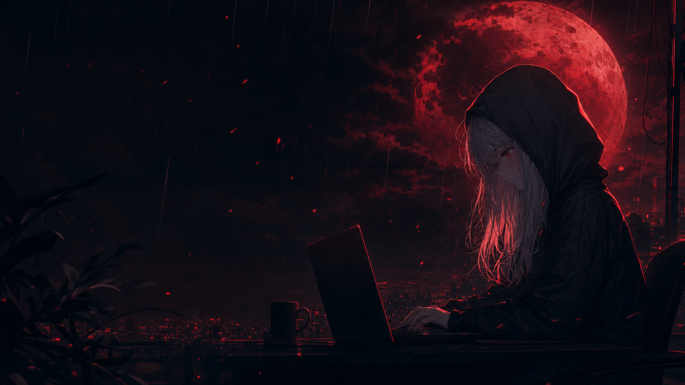

  

  Web developer yang belajar lewat eksperimen—dari Laravel

  

## About me

- 🔭 Sedang mengembangkan project web
- 🌱 Belajar Laravel, PHP, CSS, dan JavaScript
- 🎨 Menyukai desain gelap dengan sentuhan anime
- 📫 Temukan project saya di repository GitHub

## GitHub statistics

  
  

